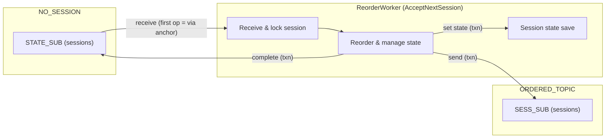
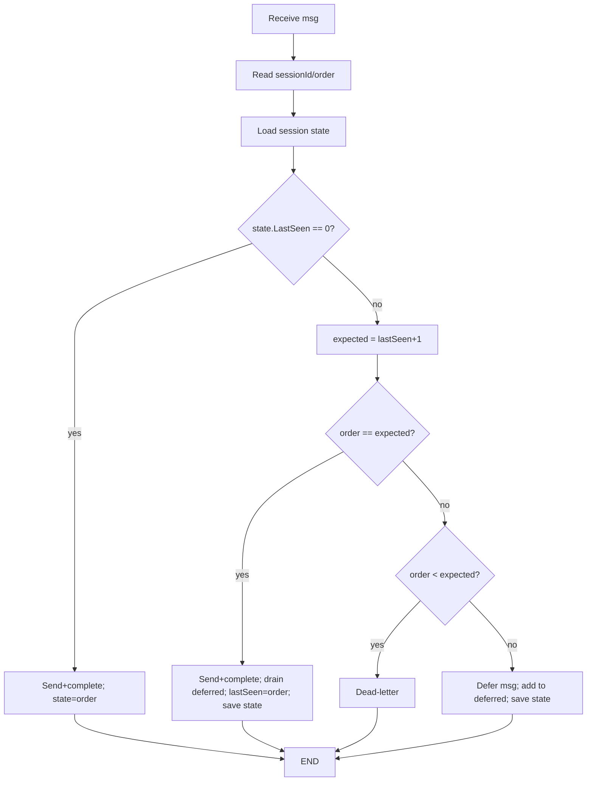

# sb-sort-function (English)

## Purpose
Azure Functions v4 (isolated, .NET 8) that reads session-enabled messages from `NO_SESSION/STATE_SUB`, reorders them by `sessionId` + `order`, and forwards the ordered stream to `ORDERED_TOPIC/SESS_SUB` (session-enabled). Ordering state is stored as session state on the same input subscription `NO_SESSION/STATE_SUB`. Supports emulator, Standard, and Premium namespaces.

## Key design choices
- Background worker (not `ServiceBusTrigger`) accepts sessions via `AcceptNextSessionAsync` on `NO_SESSION/STATE_SUB`; this first client call anchors the send-via entity.
- One Service Bus client; `EnableCrossEntityTransactions` is driven by `ServiceBus:UseTransactions`/`ServiceBusUseTransactions` (ignored for emulator).
- TransactionScope covers clone→send→complete **and** session-state save; state is stored on `NO_SESSION/STATE_SUB`, so the whole workflow is in one transaction when enabled.
- Rationale (SDK behavior): “Enable cross entity transaction... the first entity that an operation occurs on becomes the entity through which all subsequent sends will be routed through ('send-via' entity)...” (source: [ServiceBusClientBuilder](https://learn.microsoft.com/en-us/java/api/com.azure.messaging.servicebus.servicebusclientbuilder?view=azure-java-stable)).

## Paths
- Function code: `src/`
- Tests: `tests/`
- Emulator config: `emulator/config.json`, compose: `emulator/docker-compose.sbus.yml`

## Flow (mermaid)


## Configuration
- Set `ServiceBusConnection` before running tests or the worker; otherwise tests are skipped (emulator is optional).
- Optional: `ServiceBusUseTransactions=true` to enable TransactionScope on Premium.
`src/local.settings.json` example:
```json
{
  "Values": {
    "AzureWebJobsStorage": "UseDevelopmentStorage=true",
    "FUNCTIONS_WORKER_RUNTIME": "dotnet-isolated",
    "ServiceBusConnection": "Endpoint=sb://localhost;SharedAccessKeyName=RootManageSharedAccessKey;SharedAccessKey=<emulator-key>;UseDevelopmentEmulator=true;",
    "FUNCTIONS_WORKER_PROCESS_COUNT": "1",
    "ServiceBus:UseTransactions": "false"
  }
}
```
If running inside a container and `localhost` is not reachable, use `host.docker.internal`.

## Emulator
```bash
cd emulator/
docker compose -f docker-compose.sbus.yml up -d
docker compose -f docker-compose.sbus.yml ps
# stop/clean:
docker compose -f docker-compose.sbus.yml down -v
```
If the emulator SQL container fails to start, ensure env vars are provided (defaults are baked into compose): `SQL_PASSWORD=LocalEmulatorSql123!`, `ACCEPT_EULA=Y`.

The emulator web port publishes to `5300` (internal `5300`). Prefer another? Adjust `EMULATOR_HTTP_PORT` and the port mapping in `emulator/docker-compose.sbus.yml`.

Devcontainer no longer depends on the emulator network; access the emulator from inside the container via `host.docker.internal` (added in `runArgs`).

Connection strings (emulator):
- Host OS: `Endpoint=sb://localhost;SharedAccessKeyName=RootManageSharedAccessKey;SharedAccessKey=LocalEmulatorKey123!;UseDevelopmentEmulator=true;`
- From devcontainer: `Endpoint=sb://host.docker.internal;SharedAccessKeyName=RootManageSharedAccessKey;SharedAccessKey=LocalEmulatorKey123!;UseDevelopmentEmulator=true;`

## Run the function locally
```bash
cd src/
PATH=$HOME/.dotnet:$PATH func start
```
If storage is needed, start Azurite:
```bash
docker run -d --name azurite -p 10000:10000 -p 10001:10001 -p 10002:10002 mcr.microsoft.com/azure-storage/azurite
```

## Integration tests
Project: `tests/SbReorder.Tests`.
Provide `ServiceBusConnection`; if absent, tests are skipped. `ServiceBusUseTransactions` enables tx on Premium.

- Emulator (transactions off):
```bash
PATH=$HOME/.dotnet:$PATH ServiceBusUseTransactions=false \
ServiceBusConnection="$YOUR_CONNECTION" \
dotnet test tests/SbReorder.Tests
```

- Standard namespace:
```bash
PATH=$HOME/.dotnet:$PATH ServiceBusUseTransactions=false \
ServiceBusConnection="$YOUR_CONNECTION" \
dotnet test tests/SbReorder.Tests
```

- Premium namespace (transactions on):
```bash
PATH=$HOME/.dotnet:$PATH ServiceBusUseTransactions=true \
ServiceBusConnection="$YOUR_CONNECTION" \
dotnet test tests/SbReorder.Tests
```

Latest results:
- Emulator (UseTransactions=false): PASS
- Standard (UseTransactions=false): PASS
- Premium (`UseTransactions=true`): PASS (transaction wraps only send+complete; session state is committed separately)

## Behavior
- order < expected → DLQ input message (in `NO_SESSION/STATE_SUB` DLQ).
- order > expected → defer input and record in session state on `NO_SESSION/STATE_SUB`; state save is outside the transaction.
- order == expected → send to `ORDERED_TOPIC/SESS_SUB`, complete input, then drain deferred in order.



## Devcontainer tools
- .NET SDK 8.0.417 (`global.json`)
- Azure Functions Core Tools v4 (LTS)
- git, pwsh
