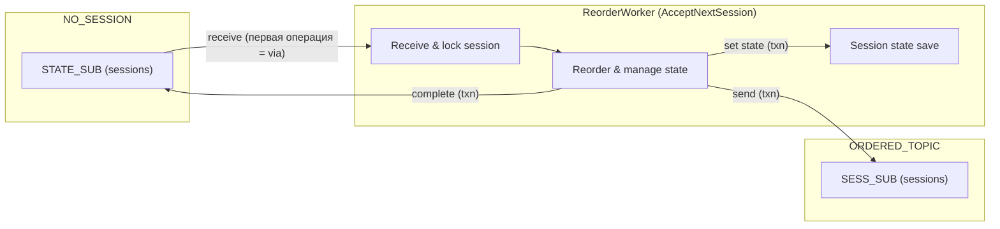
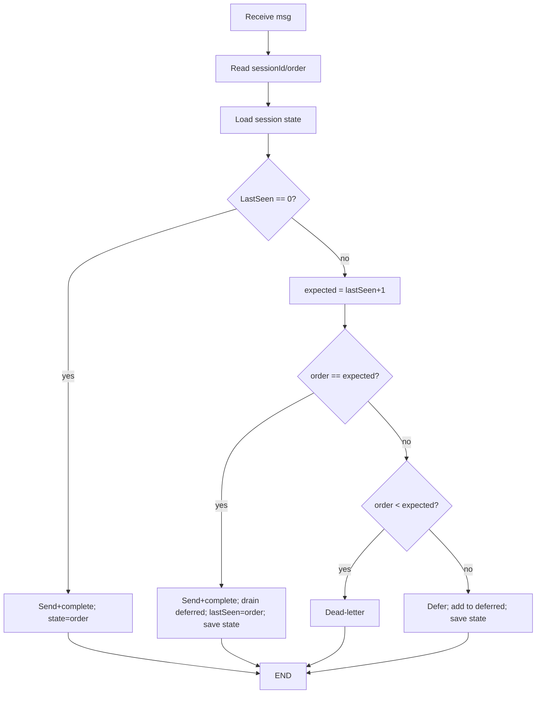

# sb-sort-function

## Назначение
Функция Azure Functions v4 (isolated, .NET 8), которая читает сессионные сообщения из `NO_SESSION/STATE_SUB`, переупорядочивает их по `sessionId` и `order`, и публикует упорядоченный поток в `ORDERED_TOPIC/SESS_SUB`. Состояние упорядочивания хранится в session state той же входной подписки `NO_SESSION/STATE_SUB`. Поддержаны три окружения:
- эмулятор Service Bus (docker compose из `emulator/docker-compose.sbus.yml`);
- стандартный namespace (без транзакций);
- premium namespace (с транзакциями на пересылке сообщений, но без транзакций при обновлении session state).

## Ключевые решения
- Фоновый воркер (без ServiceBusTrigger) принимает сессии через `AcceptNextSessionAsync` на `NO_SESSION/STATE_SUB`; это первая операция клиента, поэтому при `EnableCrossEntityTransactions=true` брокер выбирает эту подписку как send-via.
- Один клиент Service Bus: `EnableCrossEntityTransactions` берётся из `ServiceBus:UseTransactions`/`ServiceBusUseTransactions` (для эмулятора игнорируется).
- TransactionScope оборачивает clone→send→complete и сохранение session state; state живёт в `NO_SESSION/STATE_SUB`, поэтому вся работа в одной транзакции.
- Обоснование (поведение SDK): «Enable cross entity transaction... the first entity that an operation occurs on becomes the entity through which all subsequent sends will be routed through ('send-via' entity)...» (источник: [ServiceBusClientBuilder](https://learn.microsoft.com/en-us/java/api/com.azure.messaging.servicebus.servicebusclientbuilder?view=azure-java-stable)).

## Пути в репозитории
- Код функции: `src/`
- Тесты: `tests/`
- Конфиг эмулятора: `emulator/config.json`, compose: `emulator/docker-compose.sbus.yml`

## Поток (mermaid)


## Конфигурация
- Перед запуском тестов задайте `ServiceBusConnection`; если не задано — тесты будут пропущены (эмулятор опционален).
- Опционально: `ServiceBusUseTransactions=true` для Premium.
`src/local.settings.json` (для локального запуска):
```json
{
  "Values": {
    "AzureWebJobsStorage": "UseDevelopmentStorage=true",
    "FUNCTIONS_WORKER_RUNTIME": "dotnet-isolated",
    "ServiceBusConnection": "Endpoint=sb://localhost;SharedAccessKeyName=RootManageSharedAccessKey;SharedAccessKey=<emulator-key>;UseDevelopmentEmulator=true;",
    "FUNCTIONS_WORKER_PROCESS_COUNT": "1",
    "ServiceBus:UseTransactions": "false"
  }
}
```
Для контейнера, если `localhost` недоступен, замените на `host.docker.internal`.

## Запуск эмулятора
```bash
cd emulator/
docker compose -f docker-compose.sbus.yml up -d
docker compose -f docker-compose.sbus.yml ps
```
Остановить/очистить: `docker compose -f docker-compose.sbus.yml down -v`.
Если SQL контейнер эмулятора не стартует, задайте переменные (в compose есть дефолты): `SQL_PASSWORD=LocalEmulatorSql123!`, `ACCEPT_EULA=Y`.

Веб-порт эмулятора пробрасывается на `5300` (внутри — `5300`). Хотите другой — обновите `EMULATOR_HTTP_PORT` и соответствующий порт маппинг в `emulator/docker-compose.sbus.yml`.

Devcontainer больше не зависит от сети эмулятора; для доступа к эмулятору из контейнера используйте `host.docker.internal` (проброшен в `runArgs`).

Connection strings (эмулятор):
- Хостовая ОС: `Endpoint=sb://localhost;SharedAccessKeyName=RootManageSharedAccessKey;SharedAccessKey=LocalEmulatorKey123!;UseDevelopmentEmulator=true;`
- Из devcontainer: `Endpoint=sb://host.docker.internal;SharedAccessKeyName=RootManageSharedAccessKey;SharedAccessKey=LocalEmulatorKey123!;UseDevelopmentEmulator=true;`

## Запуск функции локально
```bash
cd src/
PATH=$HOME/.dotnet:$PATH func start
```
Для `AzureWebJobsStorage` при необходимости поднимите Azurite:
```bash
docker run -d --name azurite -p 10000:10000 -p 10001:10001 -p 10002:10002 mcr.microsoft.com/azure-storage/azurite
```

## Тесты (интеграционные)
Проект: `tests/SbReorder.Tests`.
Нужна переменная `ServiceBusConnection`; если её нет, тесты пропускаются. `ServiceBusUseTransactions` включает транзакции на Premium.

- Эмулятор (без транзакций):
```bash
PATH=$HOME/.dotnet:$PATH ServiceBusUseTransactions=false \
ServiceBusConnection="$YOUR_CONNECTION" \
dotnet test tests/SbReorder.Tests
```

- Standard namespace:
```bash
PATH=$HOME/.dotnet:$PATH ServiceBusUseTransactions=false \
ServiceBusConnection="$YOUR_CONNECTION" \
dotnet test tests/SbReorder.Tests
```

- Premium namespace (транзакции включены):
```bash
PATH=$HOME/.dotnet:$PATH ServiceBusUseTransactions=true \
ServiceBusConnection="$YOUR_CONNECTION" \
dotnet test tests/SbReorder.Tests
```

Результаты последнего прогона:
- Эмулятор (UseTransactions=false): PASS
- Standard (UseTransactions=false): PASS
- Premium (UseTransactions=true): PASS (транзакция только на send+complete; session state — вне транзакции)

## Поведение и ограничения
- Для order < ожидаемого сообщение уходит в DLQ входной подписки `NO_SESSION/STATE_SUB`.
- order > ожидаемого: сообщение откладывается (defer) и записывается в session state этой же подписки; состояние сохраняется вне транзакции.
- order == ожидаемому: отправка в `ORDERED_TOPIC/SESS_SUB`, complete входа, дренаж deferred.
- Из-за отсутствия публичного send-via API в 7.20.1 транзакция охватывает только send+complete; session state обновляется отдельно.



## Инструменты в devcontainer
- .NET SDK 8.0.417 (`global.json`)
- Azure Functions Core Tools v4 (LTS)
- git, pwsh
